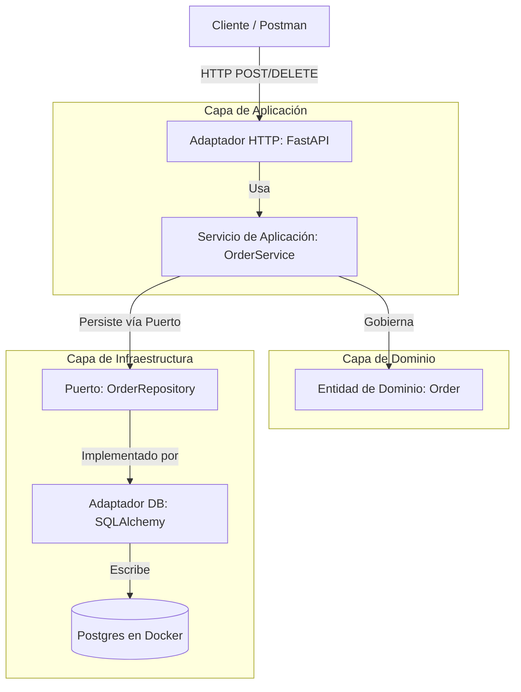

# Proyecto API de Órdenes

Este proyecto implementa un microservicio transaccional para la gestión y cancelación de órdenes utilizando Arquitectura Hexagonal (Ports & Adapters) y Domain-Driven Design (DDD). Está organizado en capas para separar completamente el dominio de las dependencias de infraestructura.

## Arquitectura del Sistema

El proyecto está estructurado aislando completamente las reglas del negocio de los componentes de infraestructura (FastAPI, SQLAlchemy, Postgres). El flujo sigue el siguiente orden:



## Tecnologías y Herramientas
* Python >=3.14
* FastAPI
* SQLAlchemy 2.0
* Alembic
* PostgreSQL
* Poetry
* Ruff, MyPy
* PyTest, Hypothesis
* pip-audit

---

## Estructura del Proyecto

* `app/domain`: Entidades y reglas de negocio.
* `app/application`: Servicios / casos de uso.
* `app/infrastructure`: Adaptadores de infraestructura (HTTP, DB, auth).
* `migrations`: Versiones de Alembic.
* `tests`: Pruebas unitarias e integración.

---

## Variables de Entorno

Copia el archivo de ejemplo y personaliza los valores locales:

```bash
cp .env.example .env
```

Valores principales:

* `POSTGRES_USER`
* `POSTGRES_PASSWORD`
* `POSTGRES_DB`
* `API_KEY_SECRET`

Si prefieres definir la conexión completa, también puedes usar `DATABASE_URL`.

> Nota: el proyecto lee la configuración desde `.env` y construye `DATABASE_URL` automáticamente si no está definido.

Para seguridad JWT, actualiza `API_KEY_SECRET` con un valor fuerte antes de desplegar en producción.

---

## Instalación

```bash
poetry install
```

---

## Ejecución Local

### 1. Levanta PostgreSQL con Docker Compose

```bash
docker-compose up -d
```

Verifica que PostgreSQL esté activo:

```bash
docker-compose ps
```

### 2. Ejecuta las migraciones

```bash
poetry run alembic upgrade head
```

### 3. Inicia la API

```bash
poetry run uvicorn app.main:app --reload --host 0.0.0.0 --port 8000
```

### 4. Abre la documentación interactiva

* `http://localhost:8000/docs`
* `http://localhost:8000/redoc`

### 5. Detén PostgreSQL (cuando termines)

```bash
docker-compose down
```

---

## Pruebas y Calidad

Ejecutar pruebas:

```bash
poetry run pytest -v
```

Ejecutar lint y formateo:

```bash
poetry run pre-commit run --all-files
```

---

## Auditoría de Dependencias

La evidencia de auditoría de dependencias se encuentra en `auditoria_seguridad.txt`.

Para generar o revisar el reporte localmente:

```bash
poetry run pip-audit -l
```

Actualmente el reporte local detecta vulnerabilidades conocidas en los siguientes paquetes:

* `msgpack 1.2.0` → fix en `1.2.1`
* `pydantic-settings 2.14.1` → fix en `2.14.2`

---

## Docker

Construye la imagen:

```bash
docker build -t api_ordenes:latest .
```

Ejecuta la imagen:

```bash
docker run --rm -p 8000:8000 api_ordenes:latest
```

---

## CI/CD

El proyecto incluye un workflow de GitHub Actions en `.github/workflows/ci.yml`. El pipeline ejecuta:

* `poetry install --all-groups`
* `poetry run ruff check app/ tests/`
* `poetry run mypy app/`
* `poetry run pytest -v`

---

## Entregables clave

* Arquitectura hexagonal clara
* API segura con JWT
* Migraciones Alembic
* Pruebas unitarias e integración
* Dockerfile multistage
* Pipeline CI
* Auditoría de dependencias
